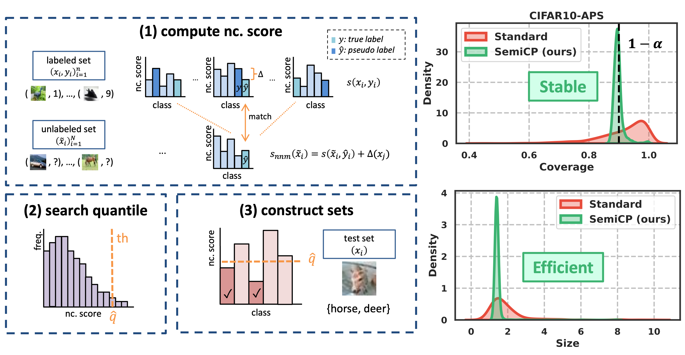

# Semi-Supervised Conformal Prediction With Unlabeled Nonconformity Score
This is the official implementation for [Semi-Supervised Conformal Prediction With Unlabeled Nonconformity Score](https://arxiv.org/abs/2505.21147) at CVPR 2026.


## Overview
In this project, we propose **SemiCP**, which can utilize both labeled data and unlabeled data for conformal prediction.

Conformal prediction (CP) is a powerful framework for uncertainty quantification, generating prediction sets with coverage guarantees. Split conformal prediction relies on labeled data in the calibration procedure. However, the labeled data is often limited in real-world scenarios, leading to unstable coverage performance in different runs. To address this issue, we extend CP to the semi-supervised setting and propose SemiCP, a new paradigm that leverages both labeled and unlabeled data for calibration. 

To achieve this, we introduce an unlabeled nonconformity score, Nearest Neighbor Matching (NNM) score. Specifically, NNM estimates the nonconformity scores of unlabeled samples using their most similar pseudo-labeled counterparts during calibration, while maintaining the original scores for labeled data. 

Theoretically, we demonstrate that the average coverage gap (i.e., the absolute difference between the empirical marginal coverage and the target coverage) of SemiCP can decrease significantly at a rate $\mathcal{O}\bigl(1/\sqrt{N}\bigr)$ and converge to an error term, where $N$ is the number of unlabeled data. Extensive experiments validate the effectiveness of SemiCP under limited labeled data, reducing the average coverage gap by up to 77% on common benchmarks with 4000 unlabeled examples, when there are only 20 labeled examples. 




## Installation

```bash
conda create -n semicp python=3.11 -y 
conda activate semicp
pip install torchcp==1.0.1
pip install torch torchvision torchaudio --index-url https://download.pytorch.org/whl/cu121
pip install -r requirements.txt
```
Note: Please make sure that the installed `torchcp` version is 1.0.1.


## Quick start
Before running the code, please make sure to update the dataset paths `DATASET_MAPPINGS` in `CONFIG.py`.

After setting the dataset paths, you can run the main script:
```bash
python main.py
```
Experimental settings can be configured in `CONFIG.py`. We also provide the parameter settings used to reproduce all results reported in the paper.

## Datasets and Pretrained Models

The paper evaluates SemiCP on CIFAR-10, CIFAR-100, and ImageNet.

For ImageNet, we use pretrained models provided by the official TorchVision implementation.
For CIFAR-10 and CIFAR-100, we provide pretrained checkpoints for reproducibility.

Pretrained models can be downloaded from: 
https://drive.google.com/drive/folders/1OvxLtLZMgY7yqY8GHi6LAvFQO-8tJgfJ?usp=sharing

## Citation
```bibtex
@misc{zhou2026semicp,
      title={Semi-Supervised Conformal Prediction With Unlabeled Nonconformity Score}, 
      author={Xuanning Zhou and Zihao Shi and Hao Zeng and Xiaobo Xia and Bingyi Jing and Hongxin Wei},
      year={2026},
      eprint={2505.21147},
      archivePrefix={arXiv},
      primaryClass={cs.LG},
      url={https://arxiv.org/abs/2505.21147}, 
}
```

## Acknowledgements

This project builds upon [TorchCP](https://github.com/ml-stat-Sustech/TorchCP), a comprehensive toolbox for conformal prediction. We highly recommend it as a valuable resource for researchers and practitioners interested in conformal prediction. If this project or the underlying codebase is useful for your research, please also cite:
```bibtex
@misc{huang2024torchcp,
      title={TorchCP: A Python Library for Conformal Prediction}, 
      author={Jianguo Huang and Jianqing Song and Xuanning Zhou and Bingyi Jing and Hongxin Wei},
      year={2024},
      eprint={2402.12683},
      archivePrefix={arXiv},
      primaryClass={cs.LG},
}
```